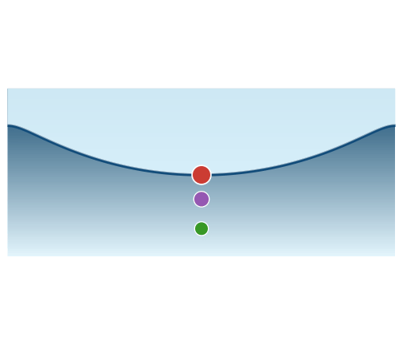

# InterfacialWaves.jl 🌊

[](https://yewalenikhil65.github.io/InterfacialWaves.jl/)



A Julia package for computing exact nonlinear steady travelling-wave and standing-wave solutions, and their linear stability, for a range of fluid configurations.

---

## Wave types

### Travelling waves

All formulations use a **conformal-mapping collocation** discretization on a periodic grid.
`LH()` and `Collocation()` are named dispatch tokens for the pure-gravity and GC solvers;
`InterfacialStokesProblem` uses the same approach with two fluid layers and is invoked via `solve(prob)` directly.

| Wave type | Problem | Key parameters | Solver |
|---|---|---|---|
| Pure gravity | `GravityProblem` | `N`, `ak` or `ε_max` | `LH()`, `Collocation()` |
| Gravity–capillary | `GCProblem` | `N`, `B`, `ε_max` | `Collocation()` |
| Viscous gravity–capillary | `ViscousGCProblem` | `N`, `Re`, `Mo`, `ε_max` | `Collocation()` |
| Viscous GC fixed-B | `ViscousGCFixedBProblem` | `N`, `Re`, `B`, `ε_max` | `Collocation()` |
| Two-fluid interfacial | `InterfacialStokesProblem` | `N`, `ρ=ρ₁/ρ₂`, `h_max` | Conformal collocation + `NewtonRaphson` |

### Standing waves

| Wave type | Module | Key parameters | Method |
|---|---|---|---|
| Axisymmetric in cylindrical basin | `InterfacialWaves.AxiStandingWaves` | `R`, `d`, `ν`, `kA` | HOSE boundary integral + Newton shooting |

---

## Quick start

### Pure gravity — Longuet–Higgins

```julia
using InterfacialWaves

sol = solve(GravityProblem(128; ak=0.40), LH())
sol.c    # phase speed
sol.ak   # steepness ak
sol.a    # Fourier coefficients [H₀/2, H₁, H₂, ...]
```

### Pure gravity — collocation

```julia
sol = solve(GravityProblem(256; ε_max=0.9), Collocation())
sol.Y    # surface elevation Y(ξ)
sol.F    # Froude number
sol.kH2  # steepness kH/2
```

### Gravity–capillary

```julia
sol = solve(GCProblem(256, 0.002; ε_max=0.5))
sol.Y; sol.F; sol.B; sol.kH2
```

### Viscous gravity–capillary

```julia
Mo  = 0.01^4 * 981.0 / 72.0^3
sol = solve(ViscousGCProblem(256, 13_000.0, Mo; ε_max=0.4);
            jacobian=:analytical, initial_state=:pure_gravity)
sol.F; sol.P; sol.B; sol.Y
```

### Two-fluid interfacial  (ρ = ρ₁/ρ₂ < 1)

```julia
sol = solve(InterfacialStokesProblem(128, 0.9; h_max=2.2, nsteps=44))
sol.c    # phase speed
sol.h    # steepness h
sol.a1   # upper-fluid Fourier coefficients
sol.a2   # lower-fluid Fourier coefficients
sol.c_n  # conformal-map coefficients
```

### Axisymmetric standing waves

```julia
using InterfacialWaves.AxiStandingWaves
import OrdinaryDiffEq as ODE
import NonlinearSolve as NLS

mesh   = CylindricalBasin(1.0, 0.5; n_fe=4, Q=8, Q_wall=16, Q_bottom=16)
solver = HOSESolver(mesh; order=3, gravity=9.81)

res = continuation(solver, SingleShooting();
        ν=5, kA_range=0.05:0.05:0.50,
        integrator=DecoupledIntegrator(solver=ODE.RK4(), n_steps=256),
        nl_alg=NLS.NewtonRaphson())

T, dT, zeta = res(0.25)        # interpolate at kA = 0.25
r = surface_nodes(mesh)
```

---

## Linear stability

All base states feed into a unified stability interface:

```julia
# Pure gravity (Longuet–Higgins convention, growth rate = Im(σ))
stab   = LinearStabProblem(base_state=sol, m=1, n_choose=100)
result = solve(stab)
max_growth_rate(result)   # Im(σ)
is_unstable(result)

# Gravity–capillary / viscous / interfacial (growth rate = Re(σ))
stab   = LinearStabProblem(base_state=sol, p=0.5, n_choose=60)
result = solve(stab)
max_growth_rate(result)   # Re(σ)
```

| Base state | Floquet param | Growth rate | Convention |
|---|---|---|---|
| LH gravity | `m = 1, 2, ...` | `Im(σ) > 0` | `:lh` |
| Gravity–capillary | `p ∈ [0, 1]` | `Re(σ) > 0` | `:gc` |
| Viscous GC | `p ∈ [0, 1]` | `Re(σ) > 0` | `:gc` |
| Interfacial | `p ∈ (0, 0.5]` | `Re(σ) > 0` | `:interfacial` |

---

## Academic research

This package has been used in the following research :

**Interfacial waves from pressure forcing: revisiting classical theories from an IVP perspective** (preprints under review)
V. K. Kadari, N. Yewale, P. K. Farsoiya, Y. S. Mayya, R. Dasgupta (2026)
*arXiv:2605.12254* · [https://arxiv.org/abs/2605.12254](https://arxiv.org/abs/2605.12254)

> Uses the gravity–capillary wave solvers to validate steady nonlinear wave profiles and dispersion relationships against IVP-based predictions for pressure-forced interfacial waves.

**A windy sea surface with Stokes waves** (preprints under review)
N. Yewale, A. Kumar, V. Kadari, R. Dasgupta (2026)
*arXiv:2608.03657* · [https://arxiv.org/abs/2608.03657](https://arxiv.org/abs/2608.03657)

> Uses the viscous gravity–capillary wave solver `ViscousGCProblem` to construct a Reynolds number–Froude number-wave energy phase-space regime map distinguishing smooth from corrugated (non-smooth) steady-state solutions for wind-forced gravity–capillary waves (4–13 cm). The paper also shows subharmonic Linear stability analysis using `LinearStabProblem`

---

Full documentation with formulation derivations, solver details, validated examples, and API reference:

[](https://yewalenikhil65.github.io/InterfacialWaves.jl/)

---

## Citation

```bibtex
@misc{InterfacialWaves,
  author  = {Yewale, Nikhil and Dasgupta, Ratul},
  title   = {{InterfacialWaves.jl}: A {Julia} Package for Nonlinear Interfacial Waves},
  year    = {2026},
  version = {0.1.0},
  url     = {https://github.com/yewalenikhil65/InterfacialWaves.jl},
  note    = {Julia package, v0.1.0},
}
```
